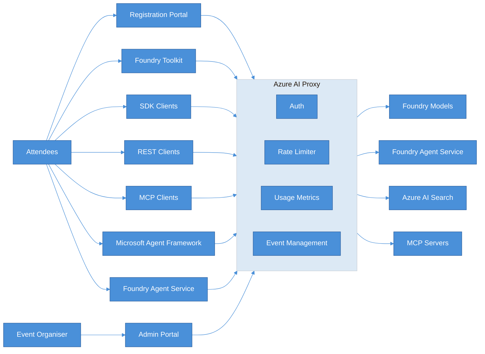
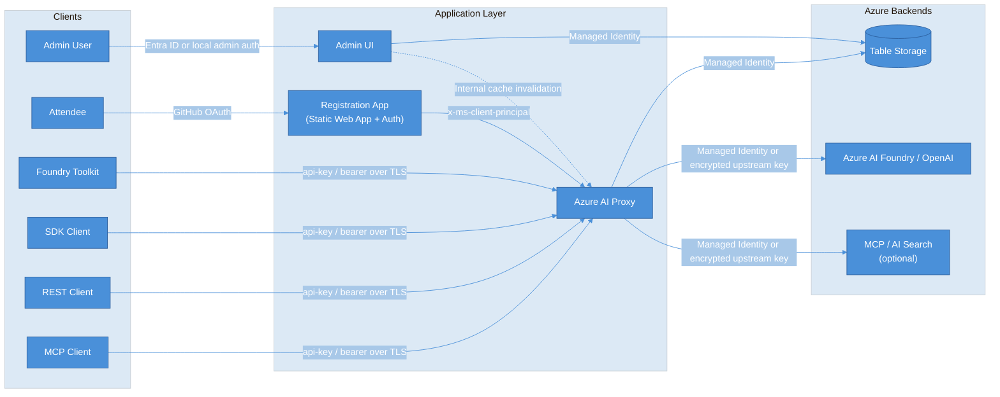

# Azure AI Proxy

A managed, multi-tenant proxy that sits between workshop attendees and Azure AI services, giving organisers full control over access, capacity, and usage tracking. Run multiple workshops simultaneously with full data isolation between events.

The solution documentation is published [here](https://microsoft.github.io/azure-ai-proxy-lite/).

For attendees using the GitHub Copilot desktop app, see the
[GitHub Copilot App setup guide with screenshots](docs/docs/github_copilot_app.md).

> **Deploying this repo?** Start with the public [Deploy to Azure guide](docs/docs/deployment/azure.md).


## Documentation by role

| Role | Start here | Continue with |
|---|---|---|
| **Event administrator** | [Deploy to Azure](docs/docs/deployment/azure.md) | [Configure resources](docs/docs/resources.md), [create events](docs/docs/events.md), [plan capacity](docs/docs/capacity.md), [review reporting](docs/docs/reporting.md), and [run load tests](docs/docs/20-service-installation/70-testing/20-load-testing.md) |
| **Event attendee** | [Register for an event](docs/docs/attendee.md) | [Configure the GitHub Copilot App](docs/docs/github_copilot_app.md) or use the [Python](examples/python/openai_sdk_1.x/azure_openai_responses.py) and [C#](examples/dotnet/microsoft_extensions_ai_responses.cs) samples |

Additional references:

- [Full documentation index](docs/docs/index.md)
- [Managed Identity configuration](docs/docs/deployment/managed_identity.md)
- [Security architecture](docs/docs/security_architecture.md)
- [Copilot concurrency test results](docs/docs/20-service-installation/70-testing/20-load-testing.md#measured-results)
- [Frequently asked questions](docs/docs/faq.md)

## Architecture



### Broad AI Service Support

- Foundry Toolkit integration for hands-on model experimentation
- Azure OpenAI chat completions & embeddings (including streaming)
- Azure AI Foundry Service Agents (assistants, threads, files, conversations, responses)
- Azure AI Search pass-through for RAG scenarios
- MCP Server endpoints with streamable HTTP transport

### Event & Attendee Management

- Time-bound events with start/end windows — API keys only work during your workshop
- Self-service attendee registration via GitHub OAuth or shared codes (great for in-person sessions where not everyone has GitHub)
- Per-event resource assignment — choose exactly which models each event can access
- Full admin portal for creating events, managing resources, viewing metrics, and backup and restore

### Capacity Controls

- Daily request cap per attendee — prevents any one person from consuming all capacity
- Max token cap per request — stops runaway token usage

### Security

- Attendees never see your real Azure API keys or endpoints
- Encrypted storage for all sensitive configuration (AES encryption)
- Managed Identity support (eliminate API key storage entirely with RBAC)
- This update streamlines how the Foundry Agent Service operates by focusing on security and identity management:

  - **Managed Identity Integration**: Automatically maps Foundry Agent Service Managed Identity requirements to the Event API Key, ensuring seamless authentication.

  - **Object Ownership Isolation**: Enhances privacy by restricting access so attendees can only interact with their own agents, threads, and files.

### Security Architecture



The proxy is the main security boundary. Attendees authenticate through the registration flow or present an event API key to the proxy, but they never receive direct access to Azure AI resources or the organizer's real upstream credentials.

In Azure, the proxy and admin app use user-assigned managed identities with RBAC for storage and AI access. The proxy also enforces event-scoped authorization, time windows, daily request caps, and token caps before forwarding approved traffic upstream.

### Reporting & Analytics

- Per-event usage dashboards: request counts, token usage, active registrations over time
- Per-model breakdown of prompt/completion tokens
- Exportable backup of all configuration data

### Deployment

- One-command deploy with `azd up` (Container Apps + Static Web App + Table Storage)
- Docker Compose for local development
- Multi-tenant — run multiple workshops simultaneously with full data isolation

#### Deploying with `azd`

```bash
azd auth login
az login
azd env new <env-name>
azd up
```

The environment name becomes part of every resource name, so it **must be 12 characters or fewer**.
Azure Container App names are capped at 32 characters and are generated as
`<env-name>-<13-char-token>-proxy`; longer names fail during provisioning.

By default `azd` creates a resource group named `<env-name>-rg`. To deploy into a different or
already-existing resource group, set these before running `azd up`:

```bash
azd env set AZURE_RESOURCE_GROUP <resource-group-name>
azd env set USE_EXISTING_RESOURCE_GROUP true   # omit or set to false to create it
```

Optional location overrides (both default to being prompted):

```bash
azd env set SWA_LOCATION eastus2       # Static Web App region
azd env set FOUNDRY_LOCATION eastus2   # Azure AI Foundry region
```

By default every resource is named `<env-name>-<token>-<suffix>`, where `<token>` is a hash that
keeps globally scoped names (storage account, container registry) unique. If you want the AI Foundry
account to carry a readable, predictable name instead, pin it explicitly:

```bash
azd env set FOUNDRY_ACCOUNT_NAME my-foundry-name   # must be globally unique
```

This also becomes the account's custom subdomain, so the endpoint reads
`https://my-foundry-name.cognitiveservices.azure.com`. Leave it unset to keep the hashed default.

##### Windows prerequisites

The `azd` pre/post-provision hooks are Bash scripts. On Windows they must run under **Git Bash**,
not WSL — `azd` invokes whichever `bash` it finds first on `PATH`, and WSL's `bash` cannot read the
Windows temp path that `azd` writes the hook script to (`exit code: 127`).

Ensure `C:\Program Files\Git\bin` precedes `C:\Windows\System32` on `PATH`, or prepend it for the
session:

```powershell
$env:PATH = 'C:\Program Files\Git\bin;' + $env:PATH
azd up
```

Docker Desktop must also be running, since the proxy and admin images are built locally before
being pushed to the container registry.

### Developer Experience

- Drop-in compatible with Azure OpenAI SDKs (Python, .NET, LangChain, REST)
- Attendees just swap their endpoint URL and use their issued API key
- Registration page shows available models and copy-paste configuration
- Single-file test samples are available for
  [Python Responses API](examples/python/openai_sdk_1.x/azure_openai_responses.py) and
  [C# with Microsoft.Extensions.AI](examples/dotnet/microsoft_extensions_ai_responses.cs)

## End-to-End Tests

Playwright tests are available under [tests/playwright](tests/playwright).

If you need to refresh Playwright dependencies manually:

```bash
npm run e2e:install
```

From the repository root:

```bash
npm run e2e:install
npm run e2e:test
```

Run authenticated E2E tests too:

```bash
E2E_RUN_AUTH_TESTS=true npm run e2e:test
```

Run the interactive UI runner:

```bash
npm run e2e:test:ui
```

## Copilot Responses Load Test

Use [`loadtest/copilot_responses_load_test.py`](loadtest/copilot_responses_load_test.py) to validate
10, 25, and 50 simultaneous Copilot-style repository sessions. The measured capacity guidance and
results are in the [load-testing documentation](docs/docs/20-service-installation/70-testing/20-load-testing.md).
The tested `gpt-5-mini` deployment supports all 50 concurrent sessions at 600K TPM.
